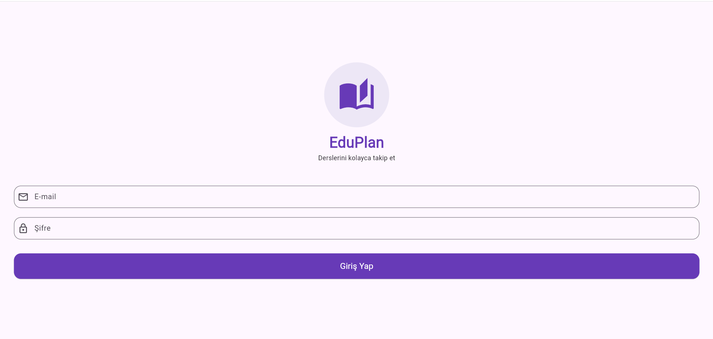
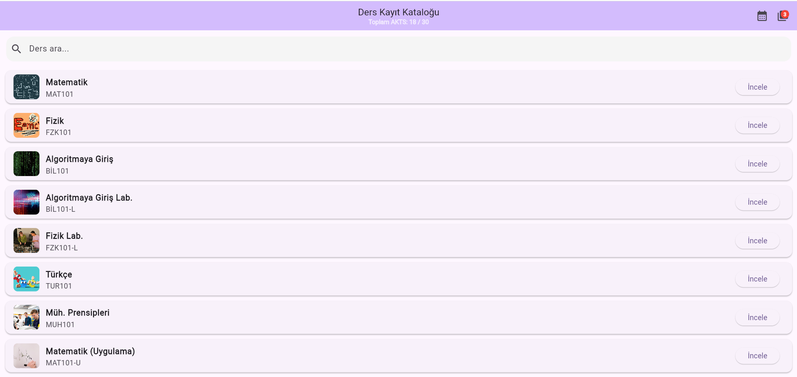
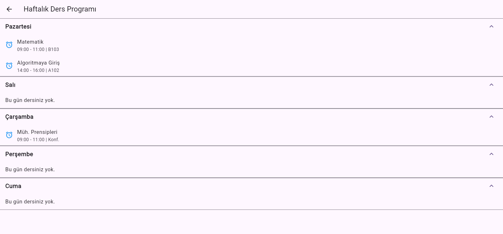
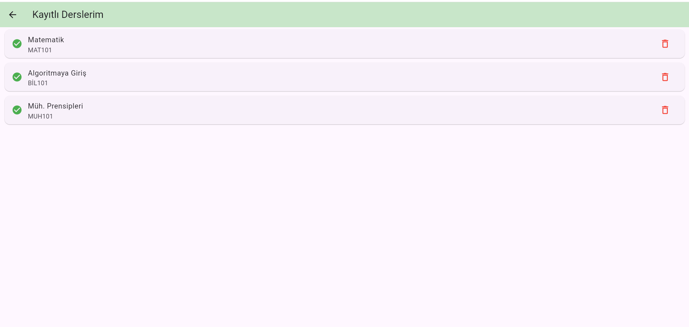

# Üniversite Ders Kayıt Uygulaması 

Bu proje, Flutter eğitim haftası kapsamında geliştirilmiş, öğrencilerin ders seçimi yapabildiği ve haftalık programlarını takip edebildiği bilgi sistemi tarzında bir mobil uygulama taslağıdır.

##  Özellikler
- **Dinamik Katalog:** Dersleri listeleyebilir ve isimlerine göre arama yapabilirsiniz.
- **AKTS Kontrolü:** Toplam 30 AKTS sınırını aşan ders seçimlerinde kullanıcıyı uyarır.
- **Haftalık Program:** Kayıtlı dersleri gün bazında (Pazartesi-Cuma) düzenli bir şekilde listeler.
- **Bildirim Balonu:** Seçilen ders sayısını ana sayfadaki ikon üzerinde anlık gösterir.

## 🛠️ Kullanılan Teknolojiler
- Flutter & Dart
- Material Design 3
- `Navigator` (Sayfa geçişleri ve veri taşıma için)
- `StatefulWidget` & `setState` (Dinamik arayüz yönetimi için)

## 📸 Ekran Görüntüleri

| Giriş Ekranı | Ana Sayfa |
| :---: | :---: |
|  |  |

| Ders Programı | Kayıtlı Dersler |
| :---: | :---: |
|  |  |

## ⚙️ Kurulum ve Çalıştırma
Uygulamayı yerel ortamınızda çalıştırmak için:

1. Projeyi klonlayın: `git clone https://github.com/reyyangencc/DersKayit_App.git`
2. Bağımlılıkları yükleyin: `flutter pub get`
3. Uygulamayı başlatın: `flutter run`

## 🛠️ Teknik Detaylar
- **Flutter Sürümü:** 3.x
- **Kullanılan Araçlar:** VS Code, Android Studio
- **Mimari:** StatefulWidget & Sayfa Geçişleri (Navigator)